---

## Level 0 → Level 1

### Level Info

> The password for the next level is stored in a file called **readme** located in the home directory. Use this password to log into bandit1 using SSH. 
> Whenever you find a password for a level, use SSH (on port 2220) to log into that level and continue the game.

---
### Commands

```bash
ssh bandit0@bandit.labs.overthewire.org -p 2220
password:bandit0
cat readme
```
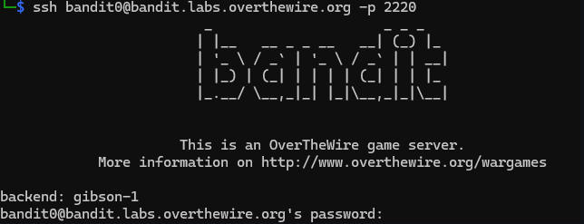
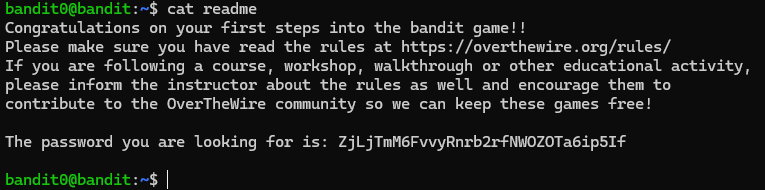

> **Password:** ZjLjTmM6FvvyRnrb2rfNWOZOTa6ip5If
### Explanation

>Just read the file using cat.
### Into the next!

```bash
ssh bandit1@bandit.labs.overthewire.org -p 2220
```

```bash
ZjLjTmM6FvvyRnrb2rfNWOZOTa6ip5If
```

---

## Level 1 → Level 2

### Level Info

>The password for the next level is stored in a file called **"-"** located in the home directory
---
### Commands

```bash
cat ./-
```

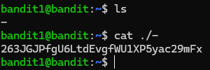

> **Password:** 263JGJPfgU6LtdEvgfWU1XP5yac29mFx

### Explanation

>The file is literally named **`-`**, but in Linux `-` usually means **standard input (stdin)**.
> Using **`./-`** forces the system to treat it as a **filename**.

### Into the next!

```bash
ssh bandit2@bandit.labs.overthewire.org -p 2220
```

```bash
263JGJPfgU6LtdEvgfWU1XP5yac29mFx
```

---

## Level 2 → Level 3

### Level Info

>The password for the next level is stored in a file called **-** located in the home directory
---
### Commands

```bash
cat -- "--spaces in this filename--"
```

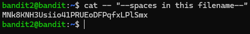

> **Password:** MNk8KNH3Usiio41PRUEoDFPqfxLPlSmx

### Explanation

>The filename contains spaces, so it must be quoted.
> Since it also starts with `--`, the `--` argument is required to stop option parsing.

### Into the next!

```bash
ssh bandit3@bandit.labs.overthewire.org -p 2220
```

```bash
MNk8KNH3Usiio41PRUEoDFPqfxLPlSmx
```

---

## Level 3 → Level 4

### Level Info

>The password for the next level is stored in a hidden file in the **inhere** directory.

---

### Commands

```bash
ls
cd inhere
ls -la
cat ...Hiding-From-You
```

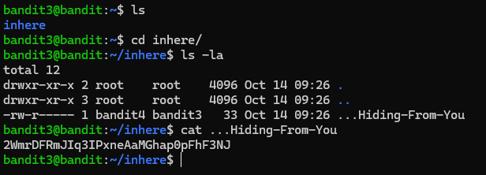

> **Password:** 2WmrDFRmJIq3IPxneAaMGhap0pFhF3NJ

### Explanation

>Files that start with `.` are hidden by default in Linux.  
>Using `ls -la` reveals hidden files, allowing the password file to be identified and read.

### Into the next!

```bash
ssh bandit4@bandit.labs.overthewire.org -p 2220
```

```bash
2WmrDFRmJIq3IPxneAaMGhap0pFhF3NJ
```

---

## Level 4 → Level 5

### Level Info

>The password for the next level is stored in the only human-readable file in the **inhere** directory.
>Tip: if your terminal is messed up, try the “reset” command.

---

### Commands

```bash
ls
cat ./-file00
file ./*
cat ./-file07
```

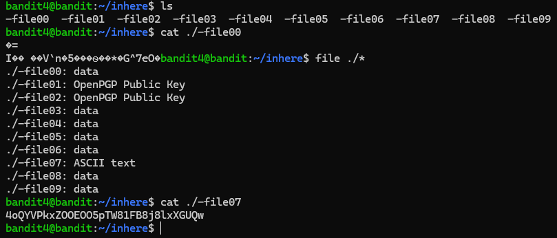

> **Password:** 4oQYVPkxZOOEOO5pTW81FB8j8lxXGUQw

### Explanation

>Most files in the directory are binary.  
>Using file type inspection helps identify the single file containing readable text with the password.

### Into the next!

```bash
ssh bandit5@bandit.labs.overthewire.org -p 2220
```

```bash
4oQYVPkxZOOEOO5pTW81FB8j8lxXGUQw
```

---

## Level 5 → Level 6

### Level Info

>The password for the next level is stored in a file somewhere under the **inhere** directory and has all of the following properties:

- human-readable
- 1033 bytes in size
- not executable

---

### Commands

```bash
ls
cd inhere/
ls
cd ..
find inhere -type f -size 1033c ! -executable -exec file {} \; | grep ASCII
cat inhere/maybehere07/.file2
```

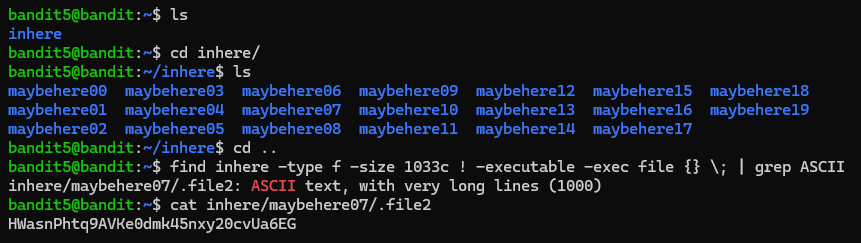

> **Password:** HWasnPhtq9AVKe0dmk45nxy20cvUa6EG

### Explanation


>The challenge requires finding a file under the *inhere* directory that is human‑readable, exactly 1033 bytes in size, and not executable.

>`find inhere` searches recursively inside the *inhere* directory.  
>`-type f` restricts the search to regular files only.  
>`-size 1033c` filters files that are exactly 1033 bytes.  
>`! -executable` excludes files with execute permissions.  
>`-exec file {} \;` runs the `file` command on each matching file to identify its type.  
>`grep ASCII` filters the output to show only human‑readable (ASCII) files.

>This combination isolates the single file containing the password.

### Into the next!

```bash
ssh bandit6@bandit.labs.overthewire.org -p 2220
```

```bash
HWasnPhtq9AVKe0dmk45nxy20cvUa6EG
```

---

## Level 6 → Level 7

### Level Info

>The password for the next level is stored **somewhere on the server** and has all of the following properties:

- owned by user bandit7
- owned by group bandit6
- 33 bytes in size

---

### Commands

```bash
find / -type f -user bandit7 -group bandit6 -size 33c 2>/dev/null
```

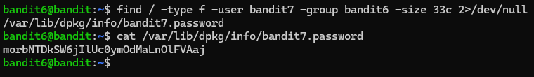

> **Password:** morbNTDkSW6jIlUc0ymOdMaLnOlFVAaj

### Explanation

>The challenge requires locating a file anywhere on the system that matches specific ownership and size properties.

>`find /` searches the entire filesystem.  
>`-type f` limits the search to regular files.  
>`-user bandit7` filters files owned by the user *bandit7*.  
>`-group bandit6` filters files owned by the group *bandit6*.  
>`-size 33c` selects files that are exactly 33 bytes in size.  
>`2>/dev/null` suppresses permission denied errors during the search.

>This combination uniquely identifies the file containing the password.

### Into the next!

```bash
ssh bandit7@bandit.labs.overthewire.org -p 2220
```

```bash
morbNTDkSW6jIlUc0ymOdMaLnOlFVAaj
```

---

## Level 7 → Level 8

### Level Info

>The password for the next level is stored in the file **data.txt** next to the word **millionth**

---

### Commands

```bash
grep "millionth" data.txt
```

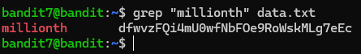

> **Password:** dfwvzFQi4mU0wfNbFOe9RoWskMLg7eEc

### Explanation

>The password is located on the same line as the word *millionth*.  
>Using `grep` searches the file and returns the matching line containing the password.

### Into the next!

```bash
ssh bandit8@bandit.labs.overthewire.org -p 2220
```

```bash
dfwvzFQi4mU0wfNbFOe9RoWskMLg7eEc
```

---

## Level 8 → Level 9

### Level Info

>The password for the next level is stored in the file **data.txt** and is the only line of text that occurs only once

---

### Commands

```bash
sort data.txt | uniq -u
```

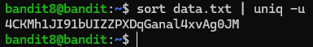

> **Password:** 4CKMh1JI91bUIZZPXDqGanal4xvAg0JM

### Explanation


>The file contains many repeated lines, with only one line occurring once.  
>Sorting the file groups identical lines, allowing `uniq -u` to identify and display the unique line.

### Into the next!

```bash
ssh bandit9@bandit.labs.overthewire.org -p 2220
```

```bash
4CKMh1JI91bUIZZPXDqGanal4xvAg0JM
```

---

## Level 9 → Level 10

### Level Info

>The password for the next level is stored in the file **data.txt** in one of the few human-readable strings, preceded by several ‘=’ characters.

---

### Commands

```bash
strings data.txt | grep "="
```

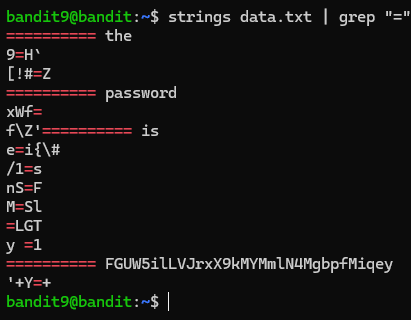

> **Password:** FGUW5ilLVJrxX9kMYMmlN4MgbpfMiqey

### Explanation

>The file contains binary data with a few human‑readable strings.  
>The `strings` command extracts readable text, and `grep "="` filters the lines preceded by `=` to reveal the password.

### Into the next!

```bash
ssh bandit10@bandit.labs.overthewire.org -p 2220
```

```bash
FGUW5ilLVJrxX9kMYMmlN4MgbpfMiqey
```

---

## Level 10 → Level 11

### Level Info

>The password for the next level is stored in the file **data.txt**, which contains base64 encoded data

---

### Commands

```bash
base64 -d data.txt
```

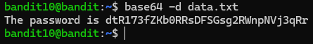

> **Password:** dtR173fZKb0RRsDFSGsg2RWnpNVj3qRr

### Explanation

>The file contains data encoded in Base64 format.  
>Using `base64 -d` decodes the content, revealing the original text which contains the password.

### Into the next!

```bash
ssh bandit11@bandit.labs.overthewire.org -p 2220
```

```bash
dtR173fZKb0RRsDFSGsg2RWnpNVj3qRr
```

---

## Level 11 → Level 12

### Level Info

>The password for the next level is stored in the file **data.txt**, where all lowercase (a-z) and uppercase (A-Z) letters have been rotated by 13 positions

---

### Commands

```bash
cat data.txt | tr 'A-Za-z' 'N-ZA-Mn-za-m'
```

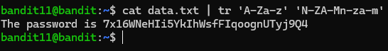

> **Password:** 7x16WNeHIi5YkIhWsfFIqoognUTyj9Q4

### Explanation

### Explanation

>The file content is encoded using the ROT13 cipher, which shifts each letter by 13 positions.  

>**Syntax:** `tr SET1 SET2`  
>- `SET1` represents the characters to be replaced (here: all uppercase and lowercase letters `'A-Za-z'`).  
>- `SET2` represents the characters to map them to (here: `'N-ZA-Mn-za-m'`, i.e., letters rotated 13 positions).  

>Each letter in the file is translated according to this mapping, revealing the password.  

### Into the next!

```bash
ssh bandit12@bandit.labs.overthewire.org -p 2220
```

```bash
7x16WNeHIi5YkIhWsfFIqoognUTyj9Q4
```

---

## Level 12 → Level 13

### Level Info

>The password for the next level is stored in the file **data.txt**, which is a hexdump of a file that has been repeatedly compressed. For this level it may be useful to create a directory under /tmp in which you can work. Use mkdir with a hard to guess directory name. Or better, use the command “mktemp -d”. Then copy the datafile using cp, and rename it using mv (read the manpages!)

---

### Commands

```bash
mkdir /tmp/and_binho_berde
cd /tmp/and_binho_berde
cp ~/data.txt .
xxd -r data.txt > data
file data
# Decompress according to the detected format:
# gzip  -> gunzip
# bzip2 -> bunzip2
# tar   -> tar -xf
```

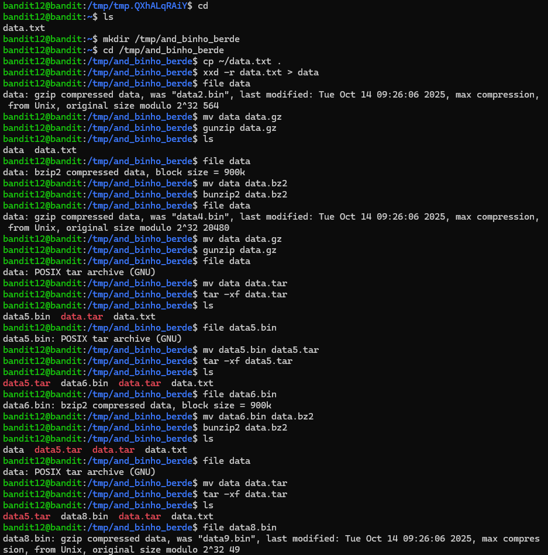
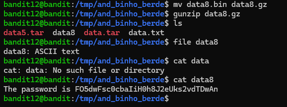

> **Password:** FO5dwFsc0cbaIiH0h8J2eUks2vdTDwAn

### Explanation

>The file `data.txt` was a hexadecimal dump of a compressed file.  
>The hexdump was first reversed to its binary form using `xxd -r`.

>Each compression layer was then identified with the `file` command and removed using the appropriate decompression tool (gzip, bzip2, or tar).  
>This process was repeated until a human‑readable text file was obtained, revealing the password.

### Into the next!

```bash
ssh bandit13@bandit.labs.overthewire.org -p 2220
```

```bash
FO5dwFsc0cbaIiH0h8J2eUks2vdTDwAn
```

---